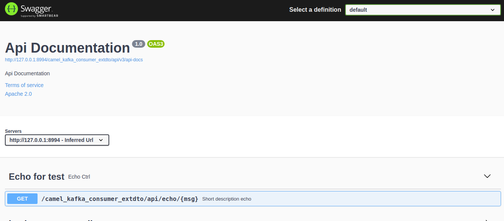

## Camel consumer Kafka for ExtDTO 

Library ExtDto [https://github.com/cherepakhin/shop_kotlin_extdto](https://github.com/cherepakhin/shop_kotlin_extdto/tree/main/src/main/kotlin/ru/perm/v/shopkotlin/extdto)

Api port(defined in application.yaml): ${CAMEL_KAFKA_CONSUMER_API_PORT:8994}. Default value 8994.  For setting:

````shell
export CAMEL_KAFKA_CONSUMER_API_PORT=9999
````

Spring Actuator: http://127.0.0.1:8998/camel_kafka_consumer_extdto/api/actuator

Environment variables:

"KAFKA_SERVER" ip address Kafka server []

Set variable:

````shell
export KAFKA_SERVER=192.168.1.20
````

REST URL: /camel_kafka_consumer_extdto/api

Swagger: http://127.0.0.1:8994/camel_kafka_consumer_extdto/api/swagger-ui/index.html



## Test

Generate messages and send to topic "product_ext_dto":

````shell
$ ./send_many_messages.sh 10000
````

Run project for read messages:

````shell
./gradlew bootRun
````

Log:

````shell
INFO 20995 --- [product_ext_dto]] route1                                   : Received messages: {"n":1,"name":"NAME_1","groupDtoN":1}

....

INFO 20995 --- [product_ext_dto]] r.p.v.c.k.c.mapper.MapperProductExtDto   : ProcessorProductExtDto received: ProductExtDTO(n=9999, name='NAME_9999', groupDtoN=9999)
INFO 20995 --- [product_ext_dto]] route1                                   : Converted messages: ProductExtDTO(n=9999, name='NAME_9999', groupDtoN=9999)

````

repeat $ ./send_many_messages.sh 10000