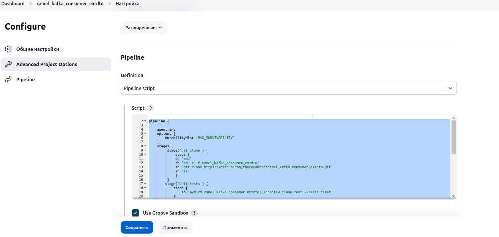
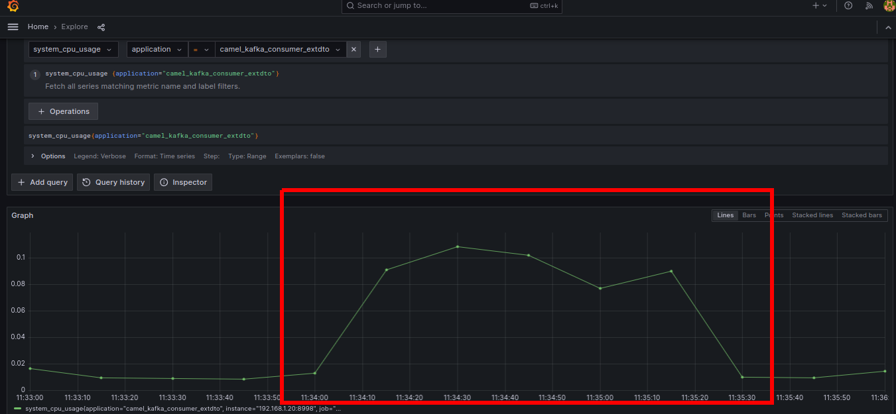
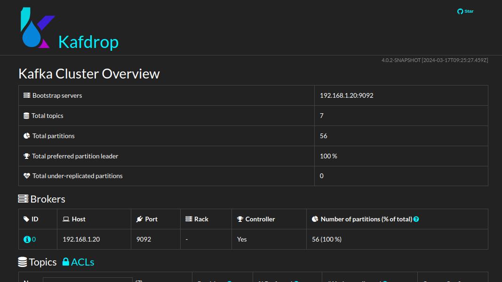

## Camel consumer Kafka for ExtDTO 

Simple receive messages (text and json) from Kafka queue with Camel.

[Environment variables:
__APP_CAMEL_KAFKA_CONSUMER_API_PORT__ - __REST API__ port __application__ (default value 8994).

Library ExtDto [https://github.com/cherepakhin/shop_kotlin_extdto](https://github.com/cherepakhin/shop_kotlin_extdto/tree/main/src/main/kotlin/ru/perm/v/shopkotlin/extdto)

Spring Actuator: http://127.0.0.1:8998/camel_kafka_consumer_extdto/api/actuator (__port: 8998__)

REST URL: /camel_kafka_consumer_extdto/api

## Simple echo REST test:

````shell
http http://127.0.0.1:8994/camel_kafka_consumer_extdto/api/echo/aaa

HTTP/1.1 200 
Connection: keep-alive
Content-Length: 3
Content-Type: text/plain;charset=UTF-8
Keep-Alive: timeout=60

aaa

````

Swagger: http://127.0.0.1:__APP_CAMEL_KAFKA_CONSUMER_API_PORT__/camel_kafka_consumer_extdto/api/swagger-ui/index.html
(default http://127.0.0.1:8994/camel_kafka_consumer_extdto/api/swagger-ui/index.html)


# Variants send to 
## Test

Generate messages and __send__ to topic "product_ext_dto":

````shell
$ ./send_many_messages.sh 10000
````

Manual receive messages:

````shell
./kafka-console-consumer.sh --bootstrap-server 192.168.1.20:9092 --topic product_ext_dto  --from-beginning
````

Config:

Задать время хранения данных в топике 3 мин (retention.ms=180 000 мсек.), после этого __УДАЛЯТЬ__ (__ДАЖЕ ЕСЛИ НЕ ПРОЧИТАНЫ!!!__):

````shell
./kafka-configs.sh --bootstrap-server 192.168.1.20:9092 --entity-type topics --entity-name product_ext_dto --alter --add-config retention.ms=180000
````

Путь для данных очередей Kafka задается в /home/vasi/tools/kafka/config/server.properties:

````text
log.dirs=/tmp/kafka-logs
````

Run project for read messages:

````shell
./gradlew bootRun
````

Log:

````shell
INFO --- [product_ext_dto]] route1                                   : Received messages: {"n":1,"name":"NAME_1","groupDtoN":1}

....

INFO --- [product_ext_dto]] r.p.v.c.k.c.mapper.MapperProductExtDto   : ProcessorProductExtDto received: ProductExtDTO(n=9999, name='NAME_9999', groupDtoN=9999)
INFO --- [product_ext_dto]] route1                                   : Converted messages: ProductExtDTO(n=9999, name='NAME_9999', groupDtoN=9999)

````

## User defined variables in application.yaml

Example of definition [MyConfig.kt](https://github.com/cherepakhin/camel_kafka_consumer_extdto/blob/main/src/main/kotlin/ru/perm/v/camel/kafka/consumer_extdto/config/MyConfig.kt)

````shell
myconfig:
  kafkaHost: 192.168.1.20:9092
  productExtDtoTopic: "product_ext_dto"
  
````

For an example of use, see [ReceiverProductExtDtoTopic.kt](https://github.com/cherepakhin/camel_kafka_consumer_extdto/blob/main/src/main/kotlin/ru/perm/v/camel/kafka/consumer_extdto/service/receiver/ReceiverProductExtDtoTopic.kt)

<a id="create_runable"></a>
### Create runable jar

Build:

````shell
./gradlew bootJar
````
(**bootJar**, NOT **bootRun!!!**)

builded jar in **./build/libs/**

run with limit RAM 256Mb:

````shell
shop_kotlin/$ java -Xmx256M -jar build/libs/camel_kafka_consumer_extdto-0.24.0313.1.jar
````

or:

````shell
cd shop_kotlin/build/libs 
shop_kotlin/build/libs$ java -Xmx256M -jar shop_kotlin-0.1.20.jar
````
### Jenkins pipeline

[Jenkinsfile](https://github.com/cherepakhin/camel_kafka_consumer_extdto/blob/main/Jenkinsfile)



### Demo Camel Route

4 examples Camel Route in [ru.perm.v.camel.kafka.consumer_extdto.service.receiver.ReceiverProductExtDtoTopic.kt](https://github.com/cherepakhin/camel_kafka_consumer_extdto/blob/main/src/main/kotlin/ru/perm/v/camel/kafka/consumer_extdto/service/receiver/ReceiverProductExtDtoTopic.kt)

````kotlin
@Component
class ReceiverProductExtDtoTopic: RouteBuilder() {
    // Example: val KAFKA_HOST = "192.168.1.20:9092"
    @Value("{\${myconfig.kafkaHost}")
    lateinit var KAFKA_HOST:String
    // Example: val PRODUCT_EXT_DTO_TOPIC="product_ext_dto"
    @Value("\${myconfig.productExtDtoTopic}")
    lateinit var PRODUCT_EXT_DTO_TOPIC:String
    @Autowired
    lateinit var receiverSpringBean: IReceiverSpringBean
    override fun configure() {
// "from()" read from kafka queue, return JSON String
        from("kafka:$PRODUCT_EXT_DTO_TOPIC?brokers=$KAFKA_HOST")
            .log("ReceiverProductExtDtoTopic. Camel \"from\" received from Kafka queue ${PRODUCT_EXT_DTO_TOPIC} body=\${body}")
// Example 1. Usage BEAN. Send to bean. Bean defined as string.
// it will be convert String to ProductExtDto defined
//      in external library: implementation("ru.perm.v:shop_kotlin_extdto".
// MapperProductExtDto is NOT REQUIRES dependence Camel.
//      method fromJson() simple receive JSON String and convert to ProductExtDto
            .to("bean:ru.perm.v.camel.kafka.consumer_extdto.mapper.MapperProductExtDto?method=fromJson")
// Example 2. usage BEAN. Send to bean with class and method.
// UserProductExtDtoService{ fun processMethod(product: ProductExtDTO): ProductExtDTO {...}}
// UserProductExtDtoService does NOT REQUIRES dependence Camel.
// function .bean() like .to(), but use simple class with any method and return any object.
// BUT method name is STRING VALUE(!).
            .bean(UserProductExtDtoService::class.java, "processMethod")
// Example 3. usage BEAN. Send bean to processor (need implemented Processor).
// Processor have default method process(exchange: Exchange?).
// ProductCamelProcessor REQUIRES dependence Camel.
// function .bean() like .to()
            .bean(ProductCamelProcessor::class.java)
// Example 4. usage BEAN. Send to autowired SPRING BEAN
            .bean(receiverSpringBean, "receive")
            .log("ReceiverProductExtDtoTopic. Converted messages: \${body}") // body is object ProductExtDto
//            .to("kafka:processed-orders")
    }
}
````

### Prometheus

Setup job in Prometheus:

````yaml
# http://127.0.0.1:8998/camel_kafka_consumer_extdto/api/actuator/"
- job_name: "camel_kafka_consumer_extdto(note 1.57)"
  scrape_interval: 5s

  #metrics_path defaults to '/metrics'
  metrics_path: "/camel_kafka_consumer_extdto/api/actuator/prometheus"
  # scheme defaults to 'http'.

  static_configs:
    - targets: ["192.168.1.57:8998"]

````

### Load test

Send 100_000 messages:

```shell
camel_kafka_consumer_extdto/doc$ ./send_many_messages.sh 100000
```
Grafana:



### Kafka Drop

UI for Kafka

[https://github.com/obsidiandynamics/kafdrop](https://github.com/obsidiandynamics/kafdrop)

JAVA 17.

Run UI Kafdrop (from v.perm.ru:/home/vasi/tools/kafdrop/):

````shell
vasi@v ~/tools/kafdrop $ ./run.sh
````

UI:

Kafdrop: http://192.168.1.20:9000/



### Other

1. Deploy to Nexus repository:

````shell
$ ./gradlew publish
````

2. Camel использует для создания ссылок на объекты собственный контекст. Однако при работе со SpringBoot сначала Camel выполняет поиск в контексте SpringBoot, а затем внедряет найденные в нем объекты в свой контекст CamelContext [https://habr.com/ru/companies/otus/articles/557068/](https://habr.com/ru/companies/otus/articles/557068/)

3. Apache Camel поддерживает использование свойств Spring Boot. Можно ссылаться на такие свойства напрямую, используя имя свойства и значение по умолчанию: __{{имя_свойства:значение_по_умолчанию}}__. Пример [ru.perm.v.camel.kafka.consumer_extdto.service.receiver.ReceiverWithParamsYAML.kt](https://github.com/cherepakhin/camel_kafka_consumer_extdto/blob/main/src/main/kotlin/ru/perm/v/camel/kafka/consumer_extdto/service/receiver/ReceiverWithParamsYAML.kt):

````kotlin
@Component
class ReceiverWithParamsYAML: RouteBuilder() {
    override fun configure() {
        from("kafka:{{myconfig.simpleTextTopic}}?brokers={{myconfig.kafkaHost}}")
            .log("ReceiverWithParamsYAML. Camel \"from\" received from Kafka queue \"{{myconfig.simpleTextTopic}}\" body=\${body}")
    }
}
````

__myconfig.kafkaHost__ и __simpleTextTopic__ заданы в  [application.yaml](https://github.com/cherepakhin/camel_kafka_consumer_extdto/blob/main/src/main/kotlin/ru/perm/v/camel/kafka/consumer_extdto/application.yaml):

````yaml
myconfig:
  kafkaHost: 192.168.1.20:9092
  simpleTextTopic: simple_text

````

Manual test:

````shell
./doc/run-producer.sh simple_text
````

Manual integration test:

````shell
camel_kafka_consumer_extdto$ ./doc/send_messages_to_param_topic.sh 100
````

Log:

````text
...
INFO 4340 --- [ram_text_topic]] route3                                   : ReceiverWithParamsYAML. Camel "from" received from Kafka queue "param_text_topic" body=message_98
INFO 4340 --- [ram_text_topic]] route3                                   : ReceiverWithParamsYAML. Camel "from" received from Kafka queue "param_text_topic" body=message_99

````

### Links:

[Apache Camel и Spring Boot](https://habr.com/ru/companies/otus/articles/557068/)
[Creating a REST service with Apache Camel](https://tomd.xyz/camel-rest/)